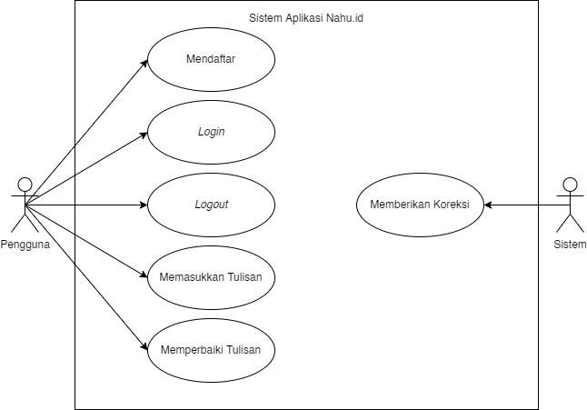
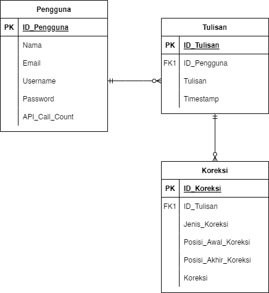
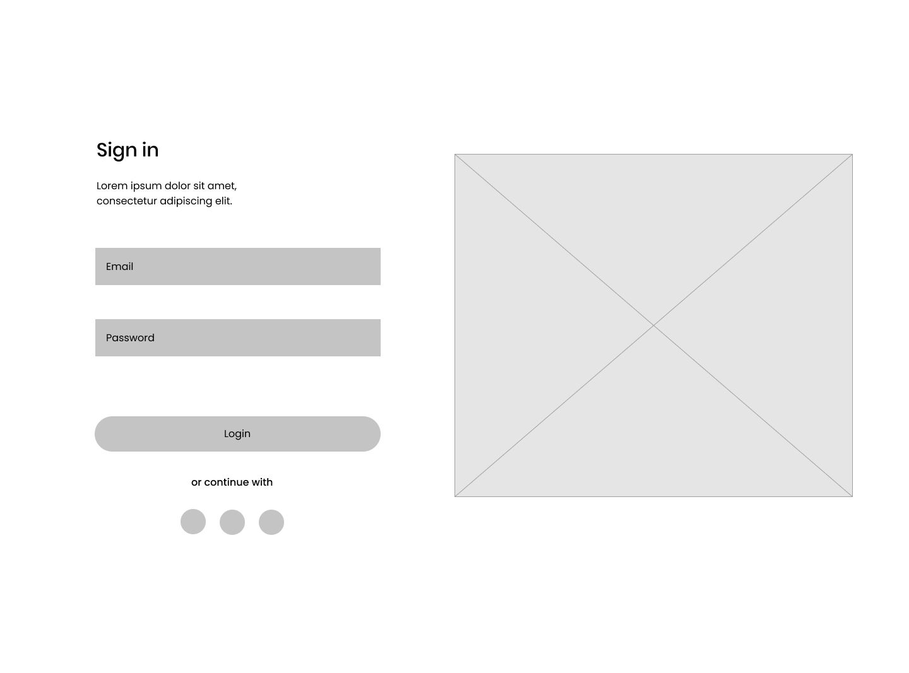
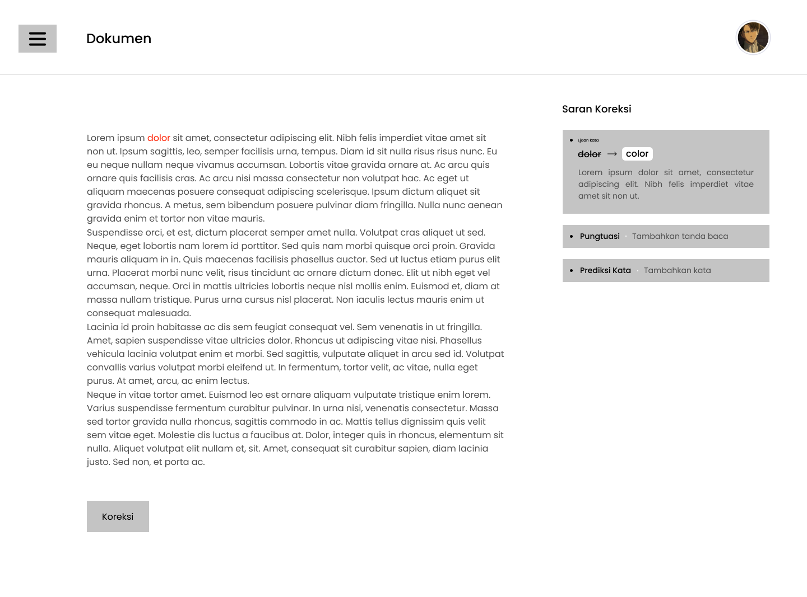

# Nahu.id

## Anggota Kelompok
<table>
<thead>
<tr>
<th align="center">Nama</th>
<th align="center">NIM</th>
<th align="center">Peran</th>
</tr>
</thead>
<tbody>
<tr>
<td align="center">Ahmad Zidan</td>
<td align="center">19/439806/TK/48536</td>
<td align="center">Project Manager &amp; Cloud Engineer</td>
</tr>
<tr>
<td align="center">Arifah Amelia Tijani</td>
<td align="center">19/446767/TK/49872</td>
<td align="center">UI/UX Designer</td>
</tr>
<tr>
<td align="center">Devi Luthfitaningrum</td>
<td align="center">19/440305/TK/48632</td>
<td align="center">AI Engineer</td>
</tr>
<tr>
<td align="center">Dicky Muhammad Rizal</td>
<td align="center">19/440306/TK/48633</td>
<td align="center">Software Engineer</td>
</tr>
</tbody>
</table>

Project Senior Project TI
Departemen Teknologi Elektro dan Teknologi Informasi, Fakultas Teknik, Universitas Gadjah Mada

## Nama Produk

> Nahu.id

## Jenis Produk

> Aplikasi Web

## Permasalahan yang dipecahkan

### Latar Belakang

> Bahasa adalah kemampuan yang hanya dimiliki manusia untuk berkomunikasi dengan manusia lainnya menggunakan tanda, misalnya kata dan gerakan. Kesalahan penulisan bahasa baku kalimat bahasa Indonesia sering terjadi. Banyak orang yang tidak memahami standar penulisan dalam bahasa Indonesia. Kesalahan tentu mengurangi kualitas teks dan maknanya ketika digunakan untuk berkomunikasi. 

### Rumusan Permasalahan

 - Bagaimana cara untuk memperbaiki kesalahan penulisan dalam bahasa Indonesia secara otomatis menggunakan teknologi?
 
- Teknologi apa sajakah yang dibutuhkan untuk membuat sistem koreksi tata bahasa secara otomatis?

### Daftar Pustaka

- A. Fahda and A. Purwarianti, "*A statistical and rule-based spelling and grammar checker for Indonesian text,*" 2017 International Conference on Data and Software Engineering (ICoDSE), 2017, pp. 1-6, doi: 10.1109/ICODSE.2017.8285846.
- F. Rahutomo, A. S. Mulyo and P. Y. Saputra, "*Automatic Grammar Checking System For Indonesian*," 2018 International Conference on Applied Science and Technology (iCAST), 2018, pp. 308-313, doi: 10.1109/iCAST1.2018.8751591.

## Ide solusi yang diusulkan beserta rancangan fitur

### Solusi

> Aplikasi web Nahu.id untuk koreksi tata bahasa Indonesia dengan menggunakan *rule-based system*.

### Rancangan Fitur Solusi

| Fitur | Keterangan |
| :----------------: | :--------------: |
| Spell Check | Memeriksa ejaan kata yang salah dan memberikan rekomendasi kata terdekat |
| Punctuation Check | Memeriksa penempatan tanda baca |
| Next Word Predictor | Memprediksi kata selanjutnya dari kalimat yang sudah ada |

## Analisis Kompetitor (Minimal 3 Kompetitor)

### KOMPETITOR 1
<table>
  <tr>
    <th>Nama</th>
    <td>Grammarly</td>
  </tr>
  <tr>
    <th>Jenis Kompetitor</th>
    <td>Indirect</td>
  </tr>
    <tr>
    <th>Jenis Produk</th>
    <td>Spelling and Grammar Corrector</td>
  </tr>
  <tr>
    <th>Target Customer</th>
    <td>Akademisi</td>
  </tr>
</table>

#### Kelebihan
-   Memiliki banyak fitur
-   Mudah diakses
-   Dikenal luas

#### Kekurangan
-  Hanya berfungsi dalam bahasa inggris

#### Key Competitive Advantage & Unique Value
> Nahu.id dapat memeriksa kalimat berbahasa Indonesia

### KOMPETITOR 2
<table>
  <tr>
    <th>Nama</th>
    <td>Ejaan.id</td>
  </tr>
  <tr>
    <th>Jenis Kompetitor</th>
    <td>Direct</td>
  </tr>
    <tr>
    <th>Jenis Produk</th>
    <td>Spell Corrector</td>
  </tr>
  <tr>
    <th>Target Customer</th>
    <td>Akademisi</td>
  </tr>
</table>

#### Kelebihan
-   Berbahasa Indonesia

#### Kekurangan
-  Tidak berfungsi dengan baik

#### Key Competitive Advantage & Unique Value
> Ejaan.id masih belum berfungsi dengan baik ketika input kata masih salah

### KOMPETITOR 3
<table>
  <tr>
    <th>Nama</th>
    <td>SIPEBI – Aplikasi Penyuntingan Ejaan Bahasa Indonesia</td>
  </tr>
  <tr>
    <th>Jenis Kompetitor</th>
    <td>Direct</td>
  </tr>
    <tr>
    <th>Jenis Produk</th>
    <td>Penyunting Ejaan</td>
  </tr>
  <tr>
    <th>Target Customer</th>
    <td>Akademisi</td>
  </tr>
</table>

#### Kelebihan
- Fiturnya cukup lengkap 
- Resmi

#### Kekurangan
-  Tidak multiplatform (hanya bisa dijalankan di Desktop Windows)

#### Key Competitive Advantage & Unique Value
> Nahu.id dirancang dapat berjalan multiplatform karena berbasis aplikasi web

## Metodologi SDLC

### Metodologi yang digunakan
> *Agile*

### Alasan pemilihan metodologi
1. Membutuhkan waktu relatif cepat dan time-to-market relatif singkat
2. Cocok untuk skala tim yang kecil
3. Adaptif dan dapat menyesuaikan kebutuhan dengan cepat
4. Dapat mengidentifikasi masalah dalam sistem lebih awal
5. Prioritas fleksibel yang berfokus pada penyampaian nilai

## Perancangan Tahap 1-3 SDLC
### Tujuan dari produk
Membantu pengguna untuk lebih memahami kesalahan tata bahasa dalam tulisan yang telah ia buat sehingga dapat memenuhi kaidah penulisan tata bahasa Indonesia yang baik.

### Pengguna potensial dari produk dan kebutuhan para pengguna tersebut 
Akademisi dan pekerja lain yang berhubungan dengan penulisan Bahasa Indonesia formal dan baku.

### Use case diagram

### Functional requirements untuk use case yang telah dirancang

<table>
<thead><tr><th>FR</th><th>Deskripsi</th></tr></thead><tbody>
 <tr><td>FR 1</td><td>Pengguna dapat mendaftarkan akun ke dalam sistem</td></tr>
 <tr><td>FR 2</td><td>Pengguna dapat <i>login</i> dengan menggunakan akun yang telah terdaftar di sistem</td></tr>
 <tr><td>FR 3</td><td>Sistem dapat memvalidasi kredensial login pengguna</td></tr>
 <tr><td>FR 4</td><td>Pengguna dapat <i>logout</i> dari sistem</td></tr>
 <tr><td>FR 5</td><td>Pengguna dapat memasukkan tulisan ke sistem</td></tr>
 <tr><td>FR 6</td><td>Pengguna dapat mengirimkan tulisan ke API sistem untuk dikoreksi</td></tr>
 <tr><td>FR 7</td><td>Sistem dapat menyediakan API untuk memberikan koreksi terhadap tulisan pengguna dengan menggunakan teknik tertentu</td></tr>
 <tr><td>FR 8</td><td>Sistem dapat membatasi pemanggilan API</td></tr>
 <tr><td>FR 9</td><td>Sistem dapat menampilkan koreksi tulisan pengguna</td></tr>
 <tr><td>FR 10</td><td>Pengguna dapat memilih koreksi tulisan sesuai yang diinginkan</td></tr>
</tbody></table>

### Entity relationship diagram

### Low-fidelity Wireframe

### Gantt-Chart pengerjaan proyek dalam kurun waktu 1 semester
<table>
  <tr>
    <td rowspan=2>Kegiatan </td>
    <td colspan=12>Pertemuan</td>
  </tr>
  <tr>
    <td>
      1
    </td>
    <td>
      2
    </td>
    <td>
      3
    </td>
    <td>
      4
    </td>
    <td>
      5
    </td>
    <td>
      6
    </td>
    <td>
      7
    </td>
    <td>
      8
    </td>
    <td>
      9
    </td>
    <td>
      10
    </td>
    <td>
      11
    </td>
    <td>
      12
    </td>
  </tr>
  <tr>
    <td>
      Brainstorming
    </td>
    <td style='background-color: black'>&nbsp;</td>
    <td style='background-color: black'>&nbsp;</td>
    <td style='background-color: black'>&nbsp;</td>
    <td>&nbsp;</td>
    <td>&nbsp;</td>
    <td>&nbsp;</td>
    <td>&nbsp;</td>
    <td>&nbsp;</td>
    <td>&nbsp;</td>
    <td>&nbsp;</td>
    <td>&nbsp;</td>
    <td>&nbsp;</td>
  </tr>
  <tr>
    <td>
      Planning
    </td>
    <td style='background-color: black'>&nbsp;</td>
    <td style='background-color: black'>&nbsp;</td>
    <td style='background-color: black'>&nbsp;</td>
    <td>&nbsp;</td>
    <td>&nbsp;</td>
    <td>&nbsp;</td>
    <td>&nbsp;</td>
    <td>&nbsp;</td>
    <td>&nbsp;</td>
    <td>&nbsp;</td>
    <td>&nbsp;</td>
    <td>&nbsp;</td>
  </tr>
  <tr>
    <td>
      Analysis
    </td>
    <td>&nbsp;</td>
    <td style='background-color: black'>&nbsp;</td>
    <td style='background-color: black'>&nbsp;</td>
    <td style='background-color: black'>&nbsp;</td>
    <td>&nbsp;</td>
    <td>&nbsp;</td>
    <td>&nbsp;</td>
    <td>&nbsp;</td>
    <td>&nbsp;</td>
    <td>&nbsp;</td>
    <td>&nbsp;</td>
    <td>&nbsp;</td>
  </tr>
  <tr>
    <td>
      UI/UX Designing &amp; Prototyping
    </td>
    <td>&nbsp;</td>
    <td style='background-color: black'>&nbsp;</td>
    <td style='background-color: black'>&nbsp;</td>
    <td style='background-color: black'>&nbsp;</td>
    <td style='background-color: black'>&nbsp;</td>
    <td style='background-color: black'>&nbsp;</td>
    <td>&nbsp;</td>
    <td>&nbsp;</td>
    <td>&nbsp;</td>
    <td>&nbsp;</td>
    <td>&nbsp;</td>
    <td>&nbsp;</td>
  </tr>
  <tr>
    <td>
      AI Development
    </td>
    <td>&nbsp;</td>
    <td>&nbsp;</td>
    <td style='background-color: black'>&nbsp;</td>
    <td style='background-color: black'>&nbsp;</td>
    <td style='background-color: black'>&nbsp;</td>
    <td style='background-color: black'>&nbsp;</td>
    <td style='background-color: black'>&nbsp;</td>
    <td style='background-color: black'>&nbsp;</td>
    <td>&nbsp;</td>
    <td>&nbsp;</td>
    <td>&nbsp;</td>
    <td>&nbsp;</td>
  </tr>
  <tr>
    <td>
      Website Development &amp; Implementation
    </td>
    <td>&nbsp;</td>
    <td>&nbsp;</td>
    <td>&nbsp;</td>
    <td>&nbsp;</td>
    <td>&nbsp;</td>
    <td style='background-color: black'>&nbsp;</td>
    <td style='background-color: black'>&nbsp;</td>
    <td style='background-color: black'>&nbsp;</td>
    <td style='background-color: black'>&nbsp;</td>
    <td style='background-color: black'>&nbsp;</td>
    <td>&nbsp;</td>
    <td>&nbsp;</td>
  </tr>
  <tr>
    <td>
      Testing &amp; Integration
    </td>
    <td>&nbsp;</td>
    <td>&nbsp;</td>
    <td>&nbsp;</td>
    <td>&nbsp;</td>
    <td>&nbsp;</td>
    <td>&nbsp;</td>
    <td>&nbsp;</td>
    <td>&nbsp;</td>
    <td>&nbsp;</td>
    <td style='background-color: black'>&nbsp;</td>
    <td style='background-color: black' >&nbsp;</td>
    <td>&nbsp;</td>
  </tr>
  <tr>
    <td>
      Deployment &amp; Demo Preparation
    </td>
    <td>&nbsp;</td>
    <td>&nbsp;</td>
    <td>&nbsp;</td>
    <td>&nbsp;</td>
    <td>&nbsp;</td>
    <td>&nbsp;</td>
    <td>&nbsp;</td>
    <td>&nbsp;</td>
    <td>&nbsp;</td>
    <td>&nbsp;</td>
    <td style='background-color: black'>&nbsp;</td>
    <td style='background-color: black'>&nbsp;</td>
  </tr>
</table>